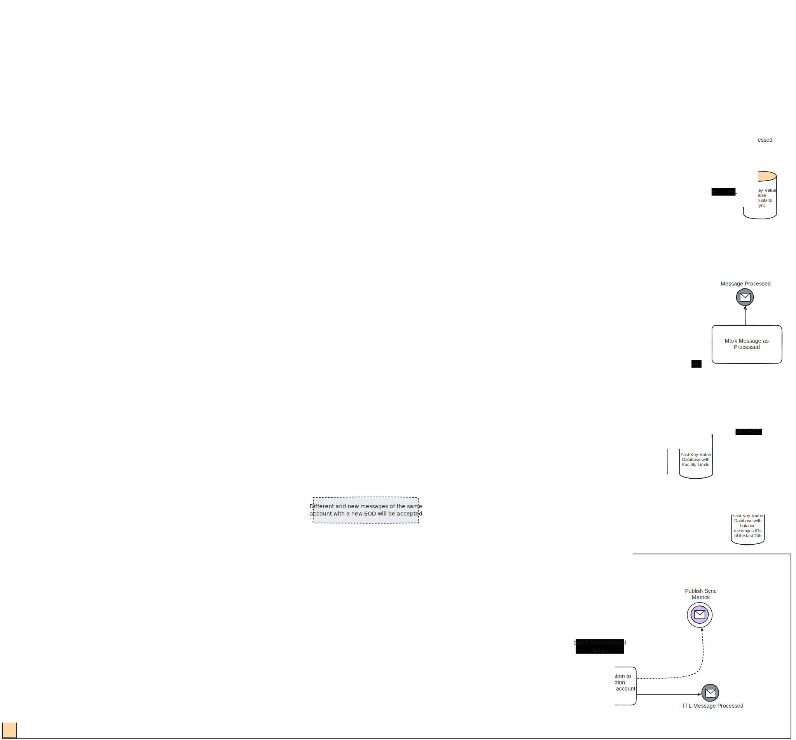
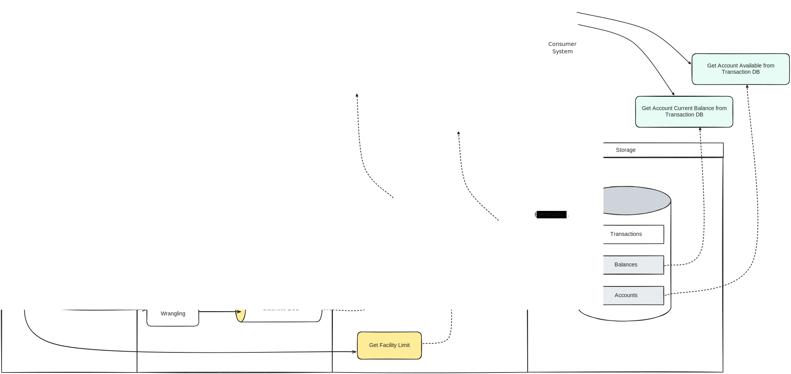
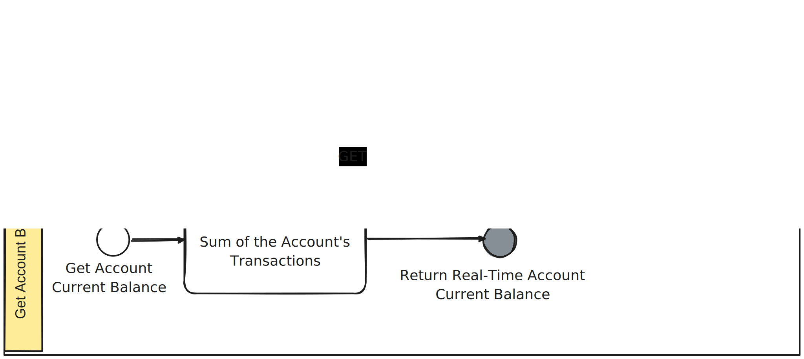
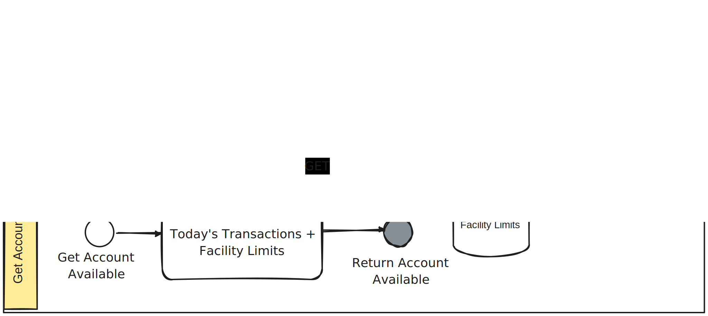
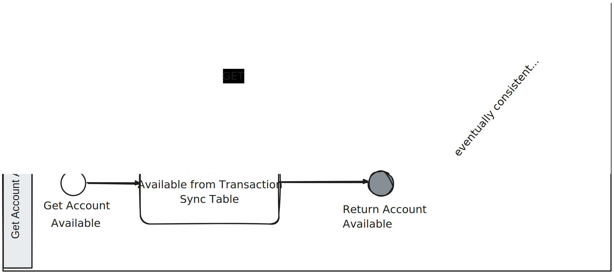
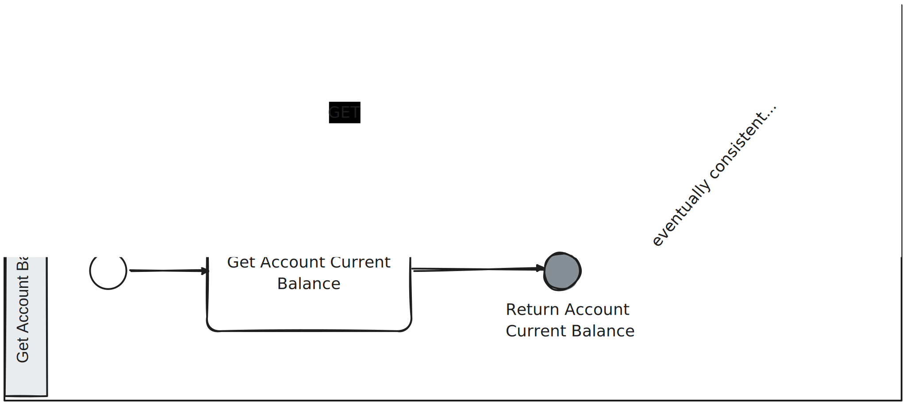
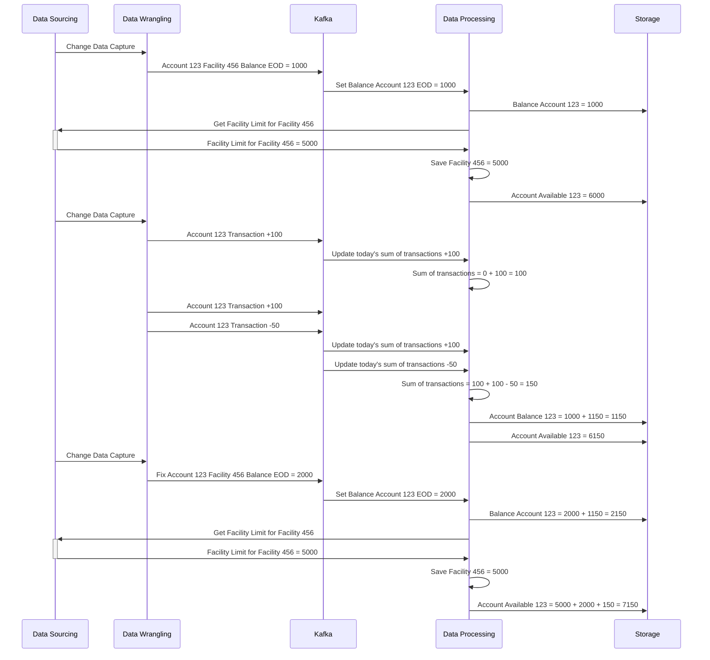
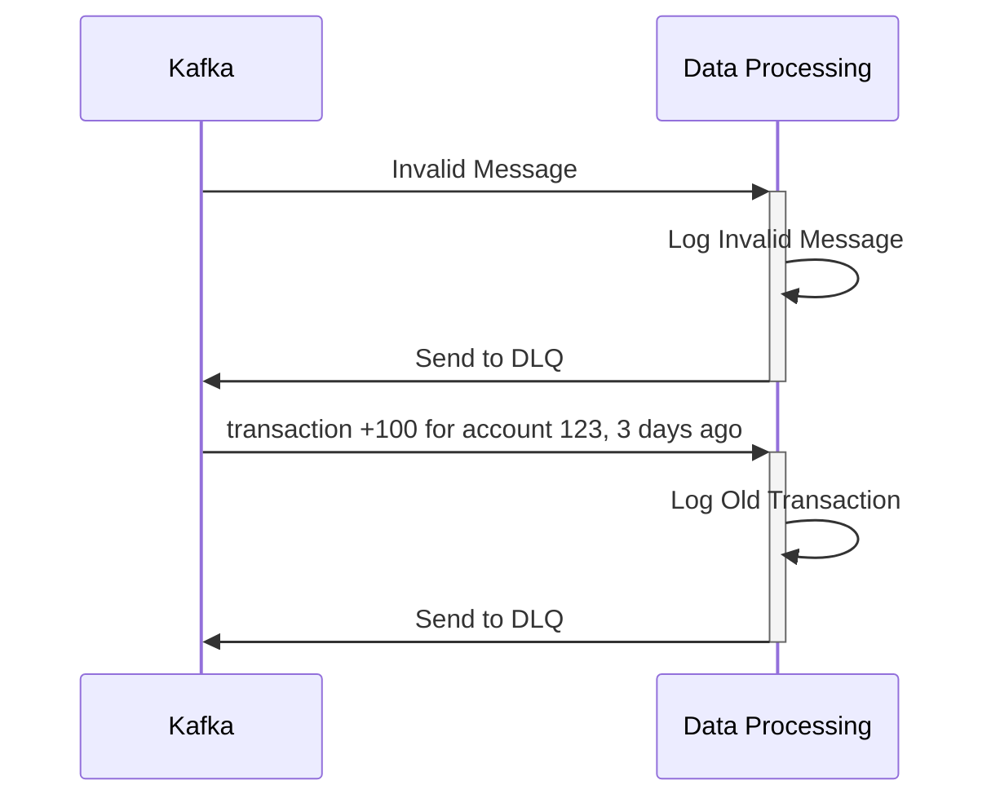
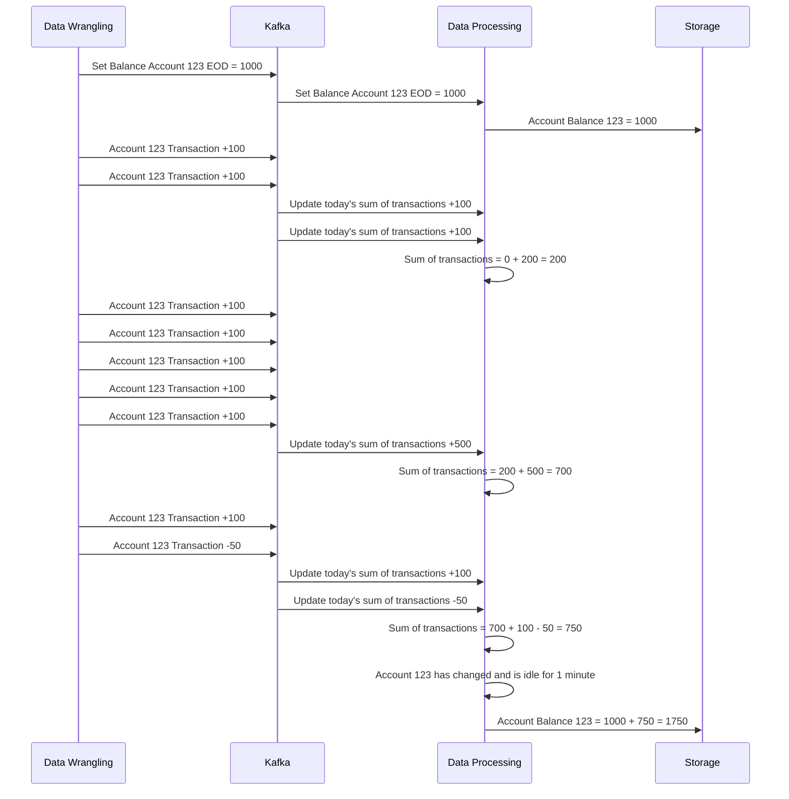

# mockbank

This is a simple project around a fictional system that implements Data Streaming Architecture.

The project is focused on the data processing of a bank system, where transactions RT (Real Time) and Balances EOD (End of the Day) are processed.

## Context

### Layers

The system is composed of four main layers:

- Data Sourcing
- Data Wrangling and Canonicalization
- Data Processing
- Storage

### Features

#### Get Real-Time Account Current Balance

The system should be able to provide the real-time account current balance.

The real-time account current balance is the balance of the end of the day plus the sum of all transactions that occurred after the end of the day.

The balance of the end of the day might be fixed by new messages on the topic.

#### Get Real-Time Account Available

The system should be able to provide the real-time account available.

The real-time account available is the Facility Limit ( obtained at last end of the day ) plus the current Real-Time Account Current Balance.

#### Get Account Available from Transaction DB

The system should be able to provide the current account available from the transactional database.

The transactional data gets the account available from the real-time account current balance. That data synchronization should be done by the real-time system. These two values are eventually consistent.

The transactional database should provide the account available for the current day.

The transactional database should provide the account balance for the end of the day.

#### Get Account Current Balance from Transaction DB

Similarly to the account available, the system should be able to provide the current account balance from the transactional database. This value is also eventually consistent with the real-time account current balance.

## Assumptions

### Facility Limit

Since the facility limit changes are not frequent and not provided by a topic, we assume that the facility limit doesn't change during the day.

Therefore, we only need to query the facility limit when we receive a new balance EOD.

If the facility limit changes during the day, we need to change the current proposed implementation to add a mechanism to detect the changes and update the real-time system frequently. That can be done by querying the facility limit at a certain frequency or by subscribing to a topic that provides the facility limit changes, if available.

### Source of Truth and Conflicts

The real-time system sends the updated balances to the transactional database in a separate table and in an eventually consistent way at all times.
The transactional database once a day, calculates and sends the final balance of each account.
The transactional database, during that calculation process, should not use the data received from the real-time system as the source of truth for the balances.

The transactional database events are the source of truth. The real-time balance is a preview of the end-of-the-day calculation that should happen in the transactional database. That calculation should be done in a database transaction, using only the transactional data.

#### Backfilling

If the real-time service receives a new value for some account EOD balance that is different and more recent than the current one, the real-time balance should update the EOD balance of that account.
The transactions related to the same account for that day should not be lost, but the balance should be updated.

### Invalid Messages

Invalid messages should be ignored and sent to a DLQ (dead-letter queue) for further analysis.
Metrics and alarms should be set to monitor the number of invalid messages and the number of messages sent to the DLQ.

Similarly, old transactions should be ignored and sent to a DLQ for further analysis.
Any old transactions should be ignored since they have already been considered in the end-of-the-day balance.

### Propagation of Changes

The transaction database is not capable of consuming all the changes from the real-time system as they happen. Therefore, the real-time system should be responsible for sending the changes using a windowing mechanism. The windowing mechanism should be able to send the changes in batches, with a maximum size of 1000 messages. Accounts that change frequently should not be updated more than once every minute. Accounts that have changed should be updated in the transactional database within 1 minute.

