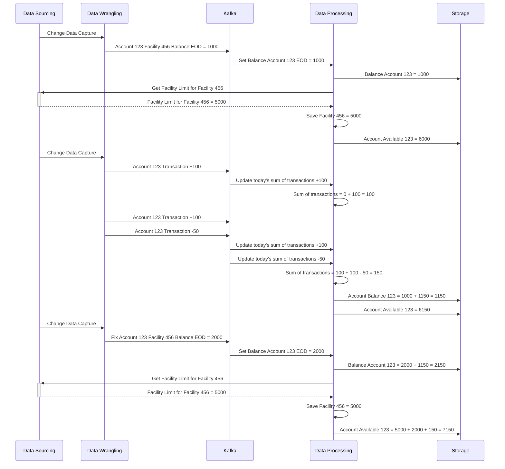
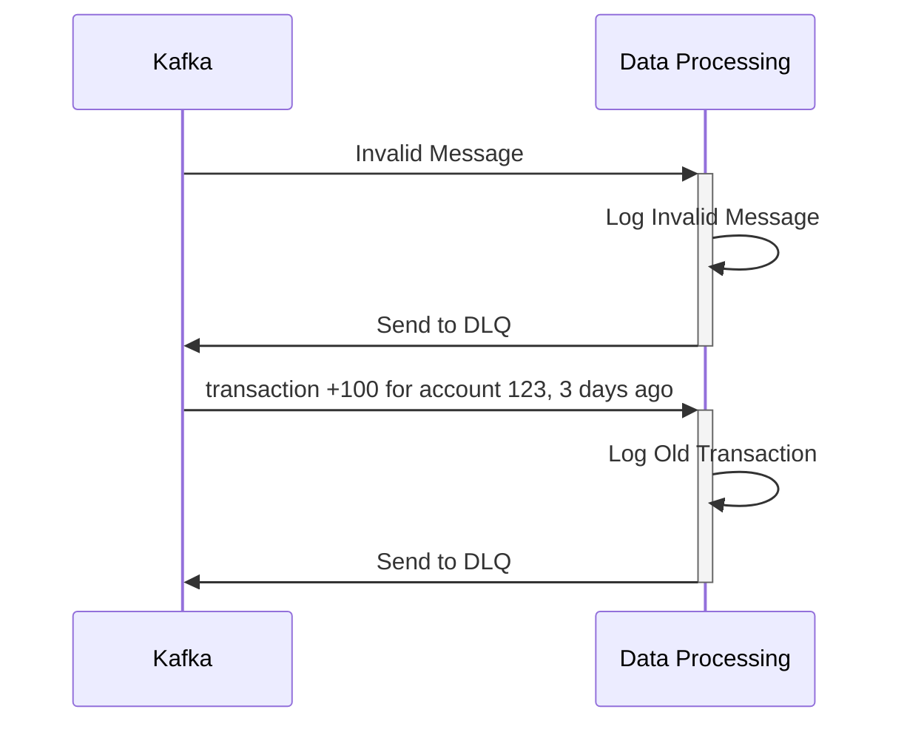
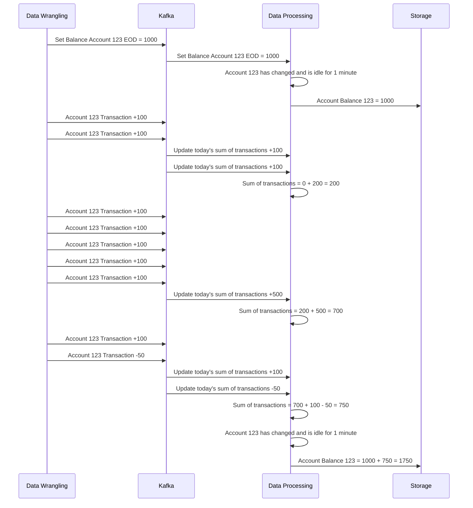

# Mock Bank

This is a simple project around a fictional system that implements Data Streaming Architecture.

The project is focused on the data processing of a bank system, where transactions RT (Real Time) and Balances EOD (End of the Day) are processed.


## Context

### Layers

The system is composed of four main layers:

- Data Sourcing
- Data Wrangling and Canonicalization
- Data Processing
- Storage


### Features

#### Get Real-Time Account Current Balance

The system should be able to provide the real-time account current balance.

The real-time account current balance is the balance of the end of the day plus the sum of all transactions that occurred after the end of the day.

The balance of the end of the day might be fixed by new messages on the topic.


```python

# pseudocode to Get Real-Time Account Current Balance

def get_real_time_account_current_balance(account_id: str) -> float:
    """
    Get the real-time account current balance.
    The real-time account current balance is the balance of the end of the day
    plus the sum of all transactions that occurred after the end of the day.

    :param account_id: The account id
    :return: The real-time account current balance

    :raises ValueError: If the account is not found
    """

    return
        get_real_time_account_end_of_day_balance(account_id) +
        get_real_time_account_transactions_sum(account_id)

def get_real_time_account_end_of_day_balance(account_id: str) -> float:
    """
    Get the real-time account end of day balance from the real-time system.

    :param account_id: The account id
    :return: The real-time account end of day balance

    :raises ValueError: If the account is not found
    """
    eod_balance = redis_client.get(f"account:{account_id}:balance:eod")
    if eod_balance is None:
        raise ValueError(f"Account {account_id} not found")
    return float(eod_balance)

def get_real_time_account_transactions_sum(account_id: str) -> float:
    """
    Get the sum of all transactions that occurred after the end of the day.

    :param account_id: The account id
    :return: The sum of all transactions that occurred after the end of the day
    :default: 0
    """

    transaction_sum_key = f"account:{account_id}:transactions:sum"

    if not redis_client.exists(transaction_sum_key):
        log.warning(f"Account {account_id} has no transactions yet.")
        metrics.increment("account_no_transactions", ["account", account_id])
        return 0

    transaction_sum = redis_client.get(transaction_sum_key)
    if transaction_sum is None:
        return 0
    return float(transaction_sum)
```
#### Get Real-Time Account Available

The system should be able to provide the real-time account available.

The real-time account available is the Facility Limit ( obtained at last end of the day ) plus the current Real-Time Account Current Balance.


```python

# pseudocode to Get Real-Time Account Available

def get_real_time_account_available(account_id: str) -> float:
    """
    Get the real-time account available.
    The real-time account available is the Facility Limit ( obtained at last end of the day )
    plus the current Real-Time Account Current Balance.

    :param account_id: The account id
    :return: The real-time account available

    :raises ValueError: If the account is not found
    """

    return
        get_real_time_account_facility_limit(account_id) +
        get_real_time_account_current_balance(account_id)


def get_real_time_account_facility_limit(account_id: str) -> float:
    """
    Get the real-time account facility limit from the real-time system.

    :param account_id: The account id
    :return: The real-time account facility limit

    :raises ValueError: If the account is not found
    """

    facility_limit = redis_client.get(f"account:{account_id}:facility:limit")
    if facility_limit is None:
        raise ValueError(f"Account {account_id} not found")
    return float(facility_limit)
```

#### Get Account Available from Transaction DB

The system should be able to provide the current account available from the transactional database.
This value is provided by the real-time system and should be eventually consistent with the real-time value. That data synchronization should be done by the real-time system.


```python

# pseudocode to Get Account Available from Transaction DB

def get_account_available_from_transaction_db(account_id: str) -> float:
    """
    Get the account available from the transactional database.
    This value is eventually consistent with the real-time account current balance.

    :param account_id: The account id
    :return: The account available value from the last sync with the real-time system

    :raises ValueError: If the account is not found
    """

    account_row = transaction_db.query(
        """
        SELECT account_available
        FROM datalake.account
        WHERE account_id = %s
        """,
        (account_id,)
    ).fetchall()
    if not account_row:
        raise ValueError(f"Account {account_id} not found")
    return account_row.account_available

```

#### Get Account Current Balance from Transaction DB

Similarly to the account available, the system should be able to provide the current account balance from the transactional database. This value is also eventually consistent with the real-time account current balance.


```python

# pseudocode to Get Account Current Balance from Transaction DB

def get_account_current_balance_from_transaction_db(account_id: str) -> float:
    """
    Get the account current balance from the transactional database.
    This value is eventually consistent with the real-time account current balance.

    :param account_id: The account id
    :return: The account current balance value from the last sync with the real-time system

    :raises ValueError: If the account is not found
    """

    account_row = transaction_db.query(
        """
        SELECT account_balance
        FROM datalake.account
        WHERE account_id = %s
        """,
        (account_id,)
    ).fetchall()
    if not account_row:
        raise ValueError(f"Account {account_id} not found")
    return account_row.account_balance

```

### Real-Time System consuming EOD Balance Message
```python

def eod_balance_message_received(msg):
    """
    Process the EOD balance message received from the topic.
    - Check if the message is valid
    - Check if the message was not already previously processed
    - Check if the message is not older than the current related message
    - Warning if the message does not match with the current calculated balance
    - Update the EOD balance with the received value

    :param msg: The EOD balance message
    """

    metrics.increment("eod_balance_messages_received", ["account",msg.accountid])

    # check if the message is valid
    if ! eod_balance_message_is_valid(msg):
        logs.warning("Invalid eod balance message received.",msg)
        metrics.increment("invalid_eod_balance_message", ["account",msg.accountid])
        send_eod_balance_message_to_dlq(msg)
        return

    # check if the message was not already previously processed
    if eod_balance_message_key_exists(msg):
        log.debug("Message duplicated, ignored", msg)
        metrics.increment("duplicated_eod_balance_message", ["account",msg.accountid])
        return

    # check if the message is not older than the current related message
    if eod_balance_message_is_older(msg):
        log.debug("Message is older than the current related message, ignored", msg)
        metrics.increment("old_eod_balance_message", ["account",msg.accountid])
        return

    # check if the message does not match with the current calculated balance
    if eod_balance_message_does_not_match(msg):
        log.debug("Message does not match with the current calculated balance, ignored", msg)
        metrics.increment("mismatch_eod_balance_message", ["account",msg.accountid])
        # do not interrupt the process, the message should be analyzed

    # update the eod balance with the received value
    update_eod_balance(msg)

def update_eod_balance(msg):
    # update the eod balance with the received value
    eod_balance_key = f"account:{msg.accountid}:balance:eod"
    redis_client.set(eod_balance_key, msg.balance)
    redis_client.expire(eod_balance_key, 86400 + 3600) # 1 day + 1 hour

    # set the key to avoid processing the same message again, with a TTL of 1 day
    msg_key = f"message:{msg.messageid}:balance:eod_timestamp"

    # set the timestamp to avoid processing older messages
    redis_client.set(msg_key, msg.timestamp)
    redis_client.expire(msg_key, 86400)

    # increment the metric for the updated balance
    metrics.increment("eod_balance_updated", ["account",msg.accountid])

    # every time we update the EOD balance, we need to update the facility limit
    update_facility_limit(msg)

def eod_balance_message_key_exists(msg) -> bool:
    """
    Check if the key for the message exists in the Redis.
    The key is used to avoid processing the same message again.
    """
    return redis_client.exists(f"message:{msg.messageid}:balance:eod_timestamp")

def eod_balance_message_is_older(msg) -> bool:
    """
    Check if the message is older than the current related message.
    The message is considered older if the timestamp exists and
    is older than the last processed message.
    """
    if not redis_client.exists(f"message:{msg.messageid}:balance:eod_timestamp"):
        return False
    last_eod_timestap = redis_client.get(f"message:{msg.messageid}:balance:eod_timestamp")
    return msg.timestamp < last_eod_timestap

def update_facility_limit(msg):
    """
    Update the real-time cache of the facility limit for the account.
    The facility limit is obtained from the facility table in the transactional database datasource.
    """
    facility_row = transaction_db.query(
        """
        SELECT facility_limit
        FROM datasource.facility
        WHERE facility_id = %s
        LIMIT 1
        """,
        (msg.facilityid,)
    ).fetchone()

    if not facility_row:
        metrics.increment("facility_not_found", ["facility",msg.facilityid])
        log.error("Facility not found", msg)
        raise ValueError(f"Facility {msg.facilityid} not found")

    redis_client.set(f"account:{msg.accountid}:facility:limit", facility_row.facility_limit)
    metrics.increment("facility_limit_updated", ["facility",msg.facilityid])
    return

```

### Real-Time System consuming Transaction Message
```python

# pseudocode to consume transaction message

def transaction_message_received(msg):
    """
    Process the transaction message received from the topic.
    - Check if the message is valid
    - Check if the message was not already previously processed
    - Check if the message is not older than the current EOD balance message
    - Update the sum of transactions with the received value
    - Update the current balance with the received value

    :param msg: The transaction message
    """

    metrics.increment("transaction_messages_received", ["account",msg.accountid])

    # check if the message is valid
    if ! transaction_message_is_valid(msg):
        logs.warning("Invalid transaction message received.",msg)
        metrics.increment("invalid_transaction_message", ["account",msg.accountid])
        send_transaction_message_to_dlq(msg)
        return

    # check if the message is not older than the current related message
    if transaction_message_is_older(msg):
        log.debug("Message is older than the current related message, ignored", msg)
        metrics.increment("old_transaction_message", ["account",msg.accountid])
        return

    # check if the message is not older than the current EOD balance message
    if transaction_message_is_older_than_eod(msg):
        log.debug("Message is older than the current EOD balance message, ignored", msg)
        metrics.increment("old_transaction_message", ["account",msg.accountid])
        return

    # update the sum of transactions with the received value
    update_sum_of_transactions(msg)

    # balance changed, update the balance sync TTL
    update_balance_sync_ttl(msg)

def update_sum_of_transactions(msg):
    # update the sum of transactions with the received value
    transaction_sum_key = f"account:{msg.accountid}:transactions:sum"


    match msg.eventType:
        case "TRANSACTION_CREATED":
            redis_client.incrbyfloat(transaction_sum_key, msg.amount)
        case "TRANSACTION_REMOVED":
            redis_client.incrbyfloat(transaction_sum_key, -msg.amount)
        case _:
            log.error("Invalid event type", msg)
            metrics.increment("invalid_event_type", ["account",msg.accountid])
            return

    # increment the metric for the updated sum of transactions
    metrics.increment("transactions_sum_updated", ["account",msg.accountid])

def update_balance_sync_ttl(msg):
    """
    Update the balance sync TTL.

    On TTL expiration, or incremental value > 1000,
        the balance should be sent to the transactional database.
    """

    # balance changed, update the balance sync TTL
    balance_sync_key = f"account:{msg.accountid}:balance:sync"

    if not redis_client.exists(balance_sync_key):
        redis_client.set(balance_sync_key,0)
    else:
        if int(redis_client.get(balance_sync_key)) > 1000:
            # send the balance to the transactional database
            send_balance_to_transaction_db(msg.accountid)
            # reset the balance sync TTL
            redis_client.set(balance_sync_key,0)
        else:
            redis_client.incr(balance_sync_key)

    redis_client.expire(balance_sync_key, 60)
    metrics.increment("balance_sync_ttl_updated", ["account",msg.accountid])

```

### Real-Time System consuming message TTL expiration
```python

# pseudocode to consume message TTL expiration

def on_balance_message_sync_ttl(msg):
"""
If the balance sync TTL expires, the balance should be sent to the transactional database.

The balance sync TTL is updated every time the balance changes.
If the balance sync TTL expires, or the incremental value is greater than 1000,
  the balance should be sent to the transactional database.
"""
    send_balance_to_transaction_db(msg.accountid)


def send_balance_to_transaction_db(account_id: str):
    """
    Send the balance to the datalake of the transactional database.

    :param account_id: The account id

    @todo do this operation on batch
    """
    account_balance = get_real_time_account_current_balance(account_id)
    account_available = get_real_time_account_available(account_id)
    transaction_db.query(
        """
        UPDATE datalake.account
        SET account_balance = %s,
            account_available = %s
        WHERE account_id = %s
        """,
        (account_balance, account_available, account_id)
    )
```

## Assumptions

### Facility Limit

Since the facility limit changes are not frequent and not provided by a topic, we assume that the facility limit doesn't change during the day.

Therefore, we only need to query the facility limit when we receive a new balance EOD.

If the facility limit changes during the day, we need to change the current proposed implementation to add a mechanism to detect the changes and update the real-time system frequently. That can be done by querying the facility limit at a certain frequency or by subscribing to a topic that provides the facility limit changes, if available.

### Source of Truth and Conflicts

The real-time system sends the updated balances to the transactional database in a separate table and in an eventually consistent way at all times.
The transactional database once a day, calculates and sends the final balance of each account.
The transactional database, during that calculation process, should not use the data received from the real-time system as the source of truth for the balances.

The transactional database events are the source of truth. The real-time balance is a preview of the end-of-the-day calculation that should happen in the transactional database. That calculation should be done in a database transaction, using only the transactional data.

#### Backfilling

If the real-time service receives a new value for some account EOD balance that is different and more recent than the current one, the real-time balance should update the EOD balance of that account.
The transactions related to the same account for that day should not be lost, but the balance should be updated.



### Invalid Messages

Invalid messages should be ignored and sent to a DLQ (dead-letter queue) for further analysis.
Metrics and alarms should be set to monitor the number of invalid messages and the number of messages sent to the DLQ.

Similarly, old transactions should be ignored and sent to a DLQ for further analysis.
Any old transactions should be ignored since they have already been considered in the end-of-the-day balance.


### Propagation of Changes

The transaction database is not capable of consuming all the changes from the real-time system as they happen. Therefore, the real-time system should be responsible for sending the changes using a windowing mechanism. The windowing mechanism should be able to send the changes in batches, with a maximum size of 1000 messages. Accounts that change frequently should not be updated more than once every minute. Accounts that have changed should be updated in the transactional database within 1 minute.

